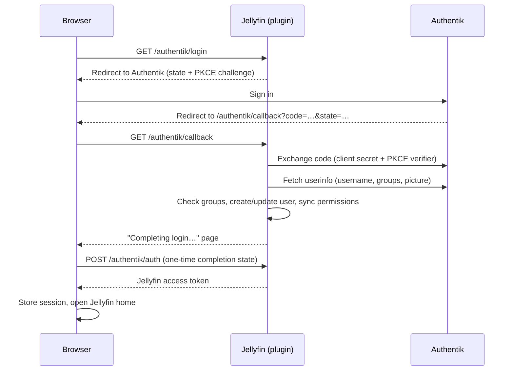

# How it works

## Sign-in flow

The plugin uses Authentik's global OAuth endpoints (`/application/o/authorize/`, `/token/`, `/userinfo/`), so only the base Authentik URL is needed. It requests the `openid profile email groups` scopes.

## Endpoints

| Endpoint | Purpose |
| --- | --- |
| `GET /authentik/login` | Starts sign-in and redirects to Authentik |
| `GET /authentik/callback` | Receives the authorization code from Authentik |
| `POST /authentik/auth` | Exchanges the one-time completion state for a Jellyfin session |

## Security notes

- **PKCE (S256) and a random `state`** protect the authorization code exchange. Pending logins expire after 5 minutes and each `state` can be used once.
- **The client secret never leaves the server.** Tokens from Authentik are used only to read userinfo and are not stored.
- **Pending logins are kept in memory.** Restarting Jellyfin while someone is mid-login makes them start again.
- **User matching** uses the `preferred_username` claim. Make sure Authentik usernames cannot be chosen freely by end users if that would let someone claim an existing Jellyfin account.
- **Auto-created users** receive a random 64-byte password, so the account can only be used through SSO unless an administrator sets a password.

## Compatibility and updates

Each release is built for one Jellyfin version, recorded as `targetAbi` in the release's `meta.json` and in the plugin catalog. Jellyfin only offers catalog versions whose `targetAbi` is not newer than the server, and refuses to load an installed plugin built for a newer server. The catalog keeps the newest release for every supported Jellyfin version, so servers that have not been upgraded keep receiving the release built for them.
